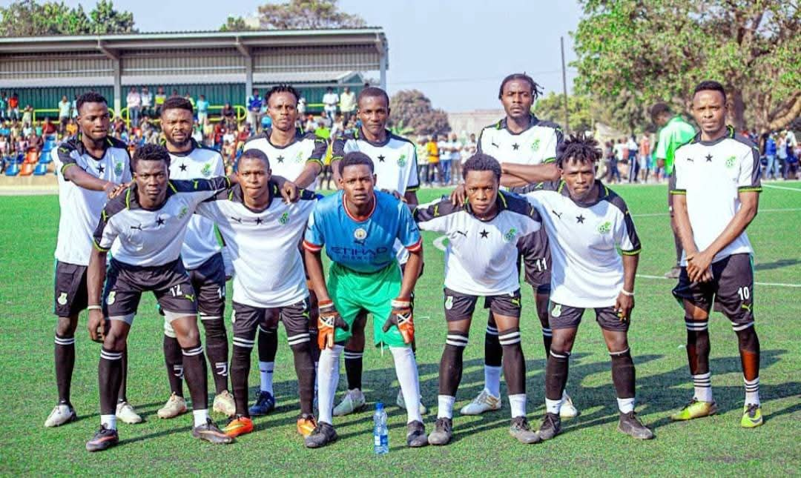
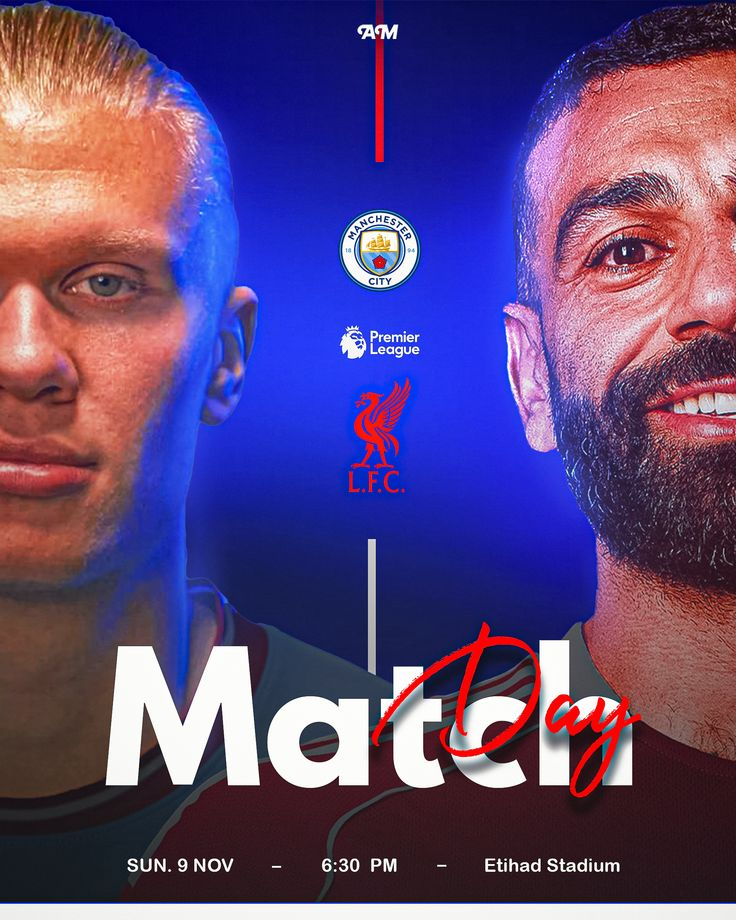

# Guide d'utilisation — Site du Tournoi Inter-quartier de Kipushi

Ce guide t'explique, tranquillement et en détail, comment modifier ton site,
ajouter des images, mettre à jour tes infos, publier le site en ligne, et
utiliser la base de données des annonces. Pas besoin d'être développeur —
suis juste les étapes une par une.

---

## 1. Comprendre où se trouve chaque chose

Ton dossier de site contient :

```
index.html          → page d'accueil
championnat.html     → page "Championnat" (histoire du tournoi)
equipe.html          → page des équipes
match.html           → page des matchs / calendrier
classement.html      → page du classement
annonces.html        → page des annonces
contact.html         → page contact
historique.html      → page historique
css/                 → toute l'apparence (couleurs, tailles, mise en page)
js/                  → toute la logique (menu, slider, animations, annonces)
images/              → toutes les photos du site
```

**Règle simple à retenir :**
- Le texte et les images → tu les changes dans le fichier `.html` de la page concernée
- Les couleurs / tailles / styles → tu les changes dans le fichier `.css` correspondant
- Tu n'as presque jamais besoin de toucher aux fichiers `.js`

**Comment ouvrir un fichier pour le modifier :**
Clique droit sur le fichier `.html` → "Ouvrir avec" → Bloc-notes (Windows) ou
TextEdit (Mac), ou encore mieux, installe gratuitement **VS Code**
(https://code.visualstudio.com) qui rend tout plus lisible avec des couleurs.

**Comment voir le résultat :**
Double-clique simplement sur le fichier `.html` → il s'ouvre dans ton navigateur
(Chrome, Firefox...). Modifie le fichier, sauvegarde, puis actualise la page
du navigateur (touche F5) pour voir le changement.

---

## 2. Modifier un texte existant

Exemple : tu veux changer la phrase d'accueil sur `index.html`.

Cherche cette ligne dans le fichier :
```html
<h1 class="titre">Bienvenue sur notre page</h1>
```

Remplace juste le texte entre les balises :
```html
<h1 class="titre">Bienvenue au tournoi 2026 !</h1>
```

Sauvegarde, actualise le navigateur : c'est fait.

**Astuce :** ne touche jamais aux mots qui commencent par `<` ou contiennent
`class="..."` — ce sont des instructions techniques. Ne modifie que le texte
lisible entre les balises.

---

## 3. Ajouter ou remplacer une image

### Remplacer une image existante (le plus simple)
1. Va dans le dossier `images/`
2. Renomme ta nouvelle photo **exactement comme l'ancienne**
   (par exemple si tu remplaces `equipe1.jpg`, ta nouvelle photo doit
   aussi s'appeler `equipe1.jpg`)
3. Glisse-la dans le dossier `images/` en écrasant l'ancienne
4. Actualise le site : la nouvelle photo apparaît automatiquement

### Ajouter une toute nouvelle image (exemple : nouvelle équipe)
1. Copie ta photo dans le dossier `images/`, donne-lui un nom simple
   sans espace ni accent, ex : `equipe13.jpg`
2. Ouvre `equipe.html`, repère une carte existante :
```html
<div class="card equipe-card reveal" style="--i:0">
    
    <div class="equipe-info">
        <h2>Katshoma 1 Fc</h2>
        <span class="badge">Groupe A</span>
    </div>
</div>
```
3. Copie ce bloc entier, colle-le juste après, et change seulement :
   - le nom de fichier de l'image (`equipe13.jpg`)
   - le nom de l'équipe
   - le groupe

**Conseil poids des images :** avant de les mettre en ligne, compresse-les sur
https://tinypng.com (gratuit) pour que le site reste rapide à charger.

---

## 4. Mettre à jour le classement et les matchs

### Modifier un score / une position dans le classement
Ouvre `classement.html`, chaque ligne d'équipe ressemble à ça :
```html
<tr><td>1</td><td>Katshoma 1 FC</td><td>3</td><td>2</td><td>0</td><td>1</td><td>5</td><td>6</td></tr>
```
Dans l'ordre : Position, Équipe, Matchs joués, Victoires, Nuls, Défaites, Buts, Points.
Change juste les chiffres qui correspondent.

### Ajouter un match dans le calendrier
Ouvre `match.html`, repère un bloc comme :
```html
<div class="card reveal" style="--i:0"><div class="card-text">KAMALENGE 1 vs KATCHOMA 2</div></div>
```
Copie-colle-le, remplace l'image et le nom des équipes.

---

## 5. Publier ton site en ligne (gratuitement)

Le plus simple pour débuter, sans rien installer : **Netlify**.

1. Va sur https://app.netlify.com/drop
2. Fais glisser **tout ton dossier de site** (celui qui contient `index.html`)
   directement dans la page
3. Netlify te donne un lien en quelques secondes, du type
   `https://ton-site-1234.netlify.app`
4. Ton site est en ligne, accessible à tout le monde !

**Pour mettre à jour le site après une modification :**
Reviens sur https://app.netlify.com, ouvre ton site, et glisse à nouveau
le dossier complet dans l'onglet "Deploys" → il remplace l'ancienne version.

*(Autres options si tu veux un nom de domaine personnalisé plus tard :
Vercel, GitHub Pages, ou l'hébergement Firebase — dis-le moi si tu veux
que je t'accompagne là-dessus.)*

---

## 6. Publier tes communiqués (résultats, photos, matchs à venir)

Cette page est **100% gérée par toi** : pas de base de données, pas de formulaire
public. Tu contrôles tout directement dans le fichier `annonces.html`, en
copiant-collant un modèle. C'est très simple, suis les étapes.

### Comment publier un nouveau communiqué
1. Ouvre le fichier `annonces.html`
2. Cherche la ligne qui dit :
```html
<!-- 👇 NOUVEAUX COMMUNIQUÉS ICI (les plus récents en premier) -->
```
3. Juste en dessous, copie l'un des 3 modèles déjà présents (résultat avec
   score + photos, match à venir, ou communiqué simple)
4. Colle-le juste après le commentaire (donc tout en haut, pour qu'il
   apparaisse en premier sur la page)
5. Modifie le texte, la date, les images et le score selon ton besoin
6. Sauvegarde, puis republie ton site (voir section 5)

### Modèle "Résultat avec score et photos"
```html
<article class="card communique reveal" data-categorie="resultat">
    <div class="entete">
        <span class="tag resultat">Résultat</span>
        <span class="date-pub">05 Juillet 2026</span>
    </div>
    <h3>Résultats de la 2ème journée</h3>
    <p class="texte">Écris ici ton petit résumé du match.</p>

    <div class="score-box">
        <span class="equipe">NOM ÉQUIPE 1</span>
        <span class="score">3 — 2</span>
        <span class="equipe">NOM ÉQUIPE 2</span>
    </div>

    <div class="photo-grid grid-2">
        
        
    </div>
</article>
```

**Important sur les photos :**
- Ajoute d'abord tes nouvelles photos dans le dossier `images/`
  (donne-leur un nom simple, ex : `journee2-photo1.jpg`)
- Puis remplace `images/ta-photo-1.jpg` par le vrai nom de ton fichier
- Tu peux mettre de 1 à 6 photos par communiqué :
  - 1 photo → utilise `class="photo-grid grid-1"`
  - 2 photos → `class="photo-grid grid-2"`
  - 3 à 6 photos → `class="photo-grid"` (par défaut, 3 colonnes)
  - Ajoute simplement une balise ``
    par photo supplémentaire

En cliquant sur une photo publiée, les visiteurs peuvent l'agrandir en plein
écran (effet "loupe").

### Modèle "Match à venir / match chaud"
```html
<article class="card communique reveal" data-categorie="avenir">
    <div class="entete">
        <span class="tag avenir">Match à venir</span>
        <span class="date-pub">06 Juillet 2026</span>
    </div>
    <h3>Titre accrocheur du match à venir</h3>
    <p class="texte">Ton message d'annonce ici.</p>
    <div class="photo-grid grid-1">
        
    </div>
</article>
```

### Modèle "Communiqué officiel simple" (sans photo)
```html
<article class="card communique reveal" data-categorie="communique-officiel">
    <div class="entete">
        <span class="tag communique-officiel">Communiqué</span>
        <span class="date-pub">06 Juillet 2026</span>
    </div>
    <h3>Titre du communiqué</h3>
    <p class="texte">Ton message ici.</p>
</article>
```

### Publier les résultats de plusieurs rencontres (ex : 3 matchs d'une journée)
Un communiqué peut contenir **plusieurs blocs de score** l'un en dessous de
l'autre. Regarde l'exemple déjà présent dans `annonces.html` ("Résultats de
la Journée 1") : il contient 3 blocs `<div class="score-box">` à la suite.
Pour ajouter ou enlever un résultat, il suffit d'ajouter ou de supprimer un
bloc comme celui-ci :
```html
<div class="score-box">
    <span class="equipe">NOM ÉQUIPE 1</span>
    <span class="score">2 — 1</span>
    <span class="equipe">NOM ÉQUIPE 2</span>
</div>
```

### Publier plusieurs "chocs de la semaine" en même temps
Pas besoin de tout mettre dans un seul bloc : publie simplement **un article
par match**, comme dans l'exemple ("Choc n°1", "Choc n°2") déjà présent dans
`annonces.html`. Duplique le modèle "Match à venir" autant de fois que tu as
de matchs chauds à annoncer.


Les boutons "Résultats", "Matchs à venir", "Communiqués" filtrent automatiquement
les annonces grâce à `data-categorie="resultat"`, `data-categorie="avenir"` ou
`data-categorie="communique-officiel"` que tu mets sur chaque bloc `<article>`.
Respecte bien l'une de ces 3 valeurs pour que le filtre fonctionne.

### Supprimer un ancien communiqué
Ouvre `annonces.html`, repère le bloc `<article class="card communique ...">
... </article>` que tu veux enlever, sélectionne-le en entier (de `<article`
jusqu'à `</article>`) et supprime-le. Sauvegarde et republie.

---

## 7. Questions fréquentes

**J'ai modifié un fichier mais rien ne change sur le site en ligne ?**
→ Tu dois republier (glisser à nouveau le dossier dans Netlify). Modifier
le fichier sur ton ordinateur ne met pas à jour automatiquement le site en ligne.

**Une image ne s'affiche pas ?**
→ Vérifie que le nom du fichier dans le code (`images/xxx.jpg`) correspond
exactement au nom du fichier dans le dossier `images/` (majuscules/minuscules
comprises).

**Un communiqué n'apparaît pas quand je clique sur un filtre (Résultats, etc.) ?**
→ Vérifie que ton bloc `<article>` a bien un `data-categorie="resultat"` (ou
`"avenir"` ou `"communique-officiel"`) qui correspond exactement à l'un des
3 filtres disponibles.

**Je me suis trompé et j'ai tout cassé, comment revenir en arrière ?**
→ Garde toujours une copie de sauvegarde de ton dossier avant de faire des
modifications importantes (fais simplement un copier-coller du dossier
complet, renomme-le "sauvegarde-date").

---

## 8. Mettre à jour les statistiques (Buteurs, Passeurs, Homme du match)

### Les popups "Meilleurs Buteurs" / "Meilleurs Passeurs"
Sur la page `annonces.html`, cherche les blocs suivants tout en bas du fichier
(après le commentaire `POPUP MEILLEURS BUTEURS`) :
```html
<tr><td class="rang top1">1</td><td>Nom du joueur</td><td>UHURU 1</td><td class="valeur">7</td></tr>
```
Chaque ligne `<tr>` représente un joueur du classement. Remplace simplement :
- `Nom du joueur` → le vrai nom du joueur
- `UHURU 1` → son équipe
- le chiffre final → son nombre de buts (ou de passes décisives pour l'autre tableau)

Tu peux ajouter ou supprimer des lignes `<tr>` librement. Mets la classe
`class="rang top1"` uniquement sur la ligne du 1er, pour qu'il ressorte en doré.

### La carte "Homme du match" (3 photos qui défilent)
Cherche la section `<section class="hm-section">` dans `annonces.html`.
Elle contient 3 blocs `.hm-slide`, un par photo :
```html
<div class="hm-slide">
    
    <div class="hm-caption">
        <span class="hm-tag">Journée 2</span>
        <h4>Nom du joueur</h4>
        <p>Équipe — NOM DE L'ÉQUIPE</p>
    </div>
</div>
```
Remplace la photo, le nom du joueur, l'équipe et le numéro de journée. Les 3
photos défilent automatiquement toutes les 3 secondes, en boucle, sans aucune
action nécessaire de ta part.

---

Si à un moment tu bloques sur une étape précise, dis-moi exactement ce que
tu essaies de faire et ce que tu vois à l'écran, je t'aiderai directement.

